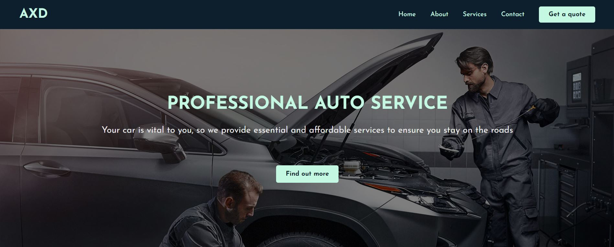

# 🚗 AXD Auto-Service Website

This is one of my biggest projects, which represents a website for a FICTIVE car service company. It was built to improve my skills which I acquired while following a Front-End Web Development training program.

Let's say your car breaks down. What do you do next? You search for a car service, right? Where? On the internet.

You come across this website and look for contact details. You find out that the service is pretty close to you and the company can send a recovery vehicle. Great!

But how can you actually get in touch with us? You can either phone us directly or complete the form with your details. Your data is safely stored on a database, so don't worry about that.

As we usually say "Check. Repair. Maintain. Repeat".

# 🌐 Links

- Live: https://axd-service.netlify.app/

# 📸 Screenshot

# 🛠 Built with:

- ReactJs

- Javascript

- CSS

- HTML

- Firebase

#
